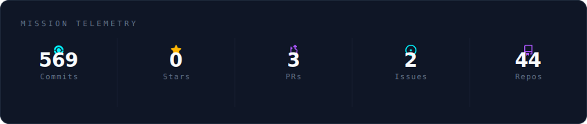

<!-- ========================================= -->
<!--              GALAXY PROFILE               -->
<!-- ========================================= -->

  

  

  

  

---

<b>More About Me</b>

 

FullCycle Software Engineer specialized in scalable systems, DevOps, and industrial monitoring platforms for the renewable energy sector.

I design and build end-to-end solutions — from architecture planning to production deployment — focusing on performance, scalability, and real-world impact.

---

  
  

